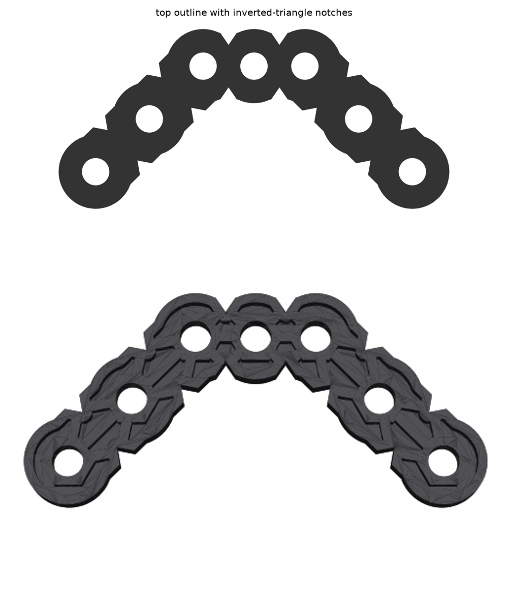

# Bent Beam (7-hole chevron liftarm) — STL recreation

A replacement STL for a lost building-kit part: a symmetric bent beam
("chevron" / boomerang liftarm) with seven pin holes. Reconstructed from
photographs and caliper measurements. Suitable for printing in PLA.



## The part

Symmetric **flat-topped arch** with **7 through-holes** on one bent
centerline:

```
      tipL - midL - innerL - APEX - innerR - midR - tipR
```

- The three top holes (innerL, APEX, innerR) sit in a short horizontal
  **top bar**; each arm then angles **down ~44.5°** to a rounded tip.
- So each arm carries three holes (inner / mid / tip) and the apex is the
  seventh hole, centered between the two inner holes.
- Rounded (semicircular) ends centered on the tip holes.
- **Scalloped ("beaded") outline**: a 12.45 mm boss lobe around each hole,
  necked in to ~11 mm between holes, with an **inverted-triangle V-notch** cut
  into each neck edge (both sides).
- **Hollow back with a truss**: hexagonal collars around each hole joined by a
  spine + diagonal ribs, leaving **triangular recessed pockets** between the
  holes (~3.6 mm deep). The **front face is left solid** as the flat mating
  side. Truss/rib/pocket sizes are *estimated* from the photos — not
  caliper-measured — so the look is close but not exact.

## Measurements used (from calipers)

| Feature | Value |
|---|---|
| Overall width (tip to tip) | 66.21 mm |
| Overall height | 30.17 mm |
| Arm width | 12.45 mm |
| Thickness | 6.00 mm |
| Hole inner diameter | 4.50 mm |

Hole layout was reconstructed from the symmetric ("^") photo by mirror-
symmetry rectification (removing camera perspective), then scaled so the
overall width matches 66.21 mm. Derived values:

- hole pitch along each arm ≈ **12.8 mm**
- apex → inner-hole horizontal offset ≈ **8.6 mm**
- tip / bend radius = 12.45 / 2 = **6.225 mm**

The model matches width and height to within ~0.2 mm and reproduces the
arm width, thickness and hole diameter exactly.

## Notes / choices

- The model is **solid** rather than reproducing the original's hollow,
  hex-ribbed back face. A solid 6 mm PLA part is stronger, prints flat with
  no supports, and the ribbing on the original is a plastic-injection
  (weight-saving) artifact, not a functional feature.
- Holes are straight 4.5 mm cylinders as measured. Printed holes tend to
  come out slightly undersized — if pins are too tight, either scale the
  part up ~1–2% or ream the holes to 4.6–4.7 mm.
- Print flat on the 6 mm face. ~30–50% infill, 3+ perimeters recommended
  for a load-bearing connector.

## Regenerating

```bash
pip install shapely trimesh scipy mapbox_earcut numpy
python make_part.py   # writes bent_beam_7hole.stl
```

Edit the parameters at the top of `make_part.py` to tweak pitch, angle,
thickness or hole size.
